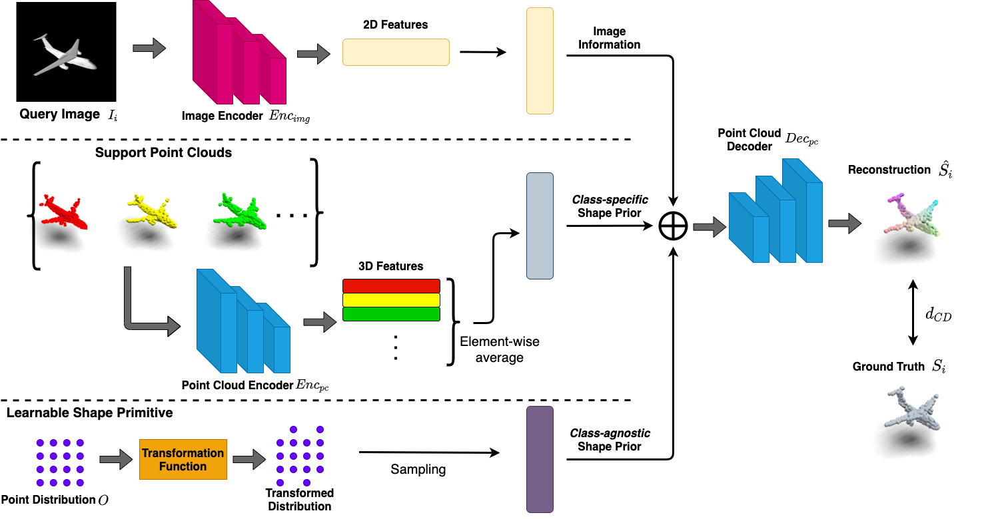

# Generating Point Cloud from Single Image in the Few Shot Scenario

This repository contains the experimental PyTorch implementation of the paper:

[**Generating Point Cloud from Single Image in the Few Shot Scenario**](https://dl.acm.org/doi/abs/10.1145/3474085.3475611) <br>
Yu Lin, Jinghui Guo, Yang Gao, Yifan Li, Zhuoyi Wang, Latifur Khan <br>
In [ACM MM 2021](https://2021.acmmm.org/)


## Introduction
In this project, we are focusing on Few shot Point cloud Single image Generation (FPSG) using class-specific & class-agnostic shape prior.
Specifically, we abstract each class by a prototype vector that embeds class-specific shape priors.
Class-agnostic shape priors are modeled by a set of learnable shape primitives that encode universal 3D shape information shared across classes.
Later, we combine the input image with class-specific prototypes and class-agnostic shape primitives to guide the point cloud generation process.
Experiment results demonstrate the superior performance of the proposed method.

## Network Architecture



There are three branches from top to bottom: 1) Image branch, 2) Class-specific shape prior branch and 3) Class-agnostic shape prior branch.

## Getting Started
### Installation

1. Clone this repo:
```
git clone https://github.com/voidstrike/FPSG.git
```

2. Install the dependencies:
* Python 3.6
* CUDA 11.0
* G++ or GCC5
* [PyTorch](http://pytorch.org/). Codes are tested with version 1.8.0
* [Kaolin](https://github.com/NVIDIAGameWorks/kaolin) 0.9.0
* [Pymesh](https://github.com/PyMesh/PyMesh) 1.0.2

### Download Datasets

[ModelNet](https://modelnet.cs.princeton.edu/) dataset can be downloaded from [ModelNet_views](https://drive.google.com/file/d/19_aSXKe2xdOCw4_jEXjJcCUrHGl-HlFF/view?usp=sharing) and [ModelNet_pcs](https://drive.google.com/file/d/1XAVg8iZrOyE02cZxGdY1f880A1KBKZuu/view?usp=sharing).
Unzip the downloaded file to your preferred directory. The 2D projections of ModelNet are from [MVCNN](https://github.com/suhangpro/mvcnn)

For the [ShapeNet](https://www.shapenet.org/) dataset, please download the dataset from their website and render it via Blender. We provide `src/view_generator.py` and `src/train_test_split.py` for the image generation and TRAIN/TEST split, respectively. Corresponding `phong.py` and `background.png` are also attached, please note that the provided code is compatible with Blender v2.79

### Run Experiments

Take ModelNet for example.

- Prepare the dataset (you will get two files: `modelnet_train.txt` and `modelnet_test.txt`, and one folder `modelnet_files/` with auxiliary files ). Please check the source code if you want to use different set of classes (categories)
```
python3 generate_dataset.py --img_path IMG_PATH --pc_path PC_PATH --dataset modelnet
```

- Train a model 
```
# General
CUDA_VISIBLE_DEVICES=X python3 trainNetwork.py --config_path TRAIN_CONFIG --test_path TEST_CONFIG --pc_encoder_path PRETRAINED_ENCODER --n_way 1 --n_shot [1-32] --name EXP_NAME --intra_recon

# Concrete
CUDA_VISIBLE_DEVICES=0 python3 trainNetwork.py --config modelnet_train.txt --test_path modelnet_test.txt --pc_encoder_path ../checkpoint/pretrain_pointnet/pretrained_pcencoder_pointnet.pt --n_way 1 --n_shot 32 --n_query 5 --num_cluster --epoch 400 --lr 0.0001 --name modelnet_exp
```

- Noted that we use the PRETRAINED_ENCODER in the command, you can also train such an encoder by running `src/trainPointAE.py`, classes (categories) are also specified in the source code.

- There are more hyper parameter options, please refer to the source code for more detail. For example, `--n_episode` and `--n_cluster`
- Please remember to modify the CUDA device number X, TRAIN_CONFIG, TEST_CONFIG and PRETRAINED_ENCODER accordingly.
- Eval a model (Actually, the evaluation code will be executed at the end of the training)

```
CUDA_VISIBLE_DEVICES=X python3 evaluae_Network.py --config_PATH TRAIN_CONFIG --test_path TEST_CONFIG --pc_encoder_path PRETRAINED_ENCODER --n_way 1 --n_shot ANYNUMBER --name EXP_NAME
```

- There are more hyper parameter options, please refer to the source code for more detail. For example, `--sequential_eval` denotes the evaluation mode.
 
## Important Note
Some codes are hard-coded so you may need to modify them based on your system and data location.

For example:

`src/datasets/modelnet.py` L112 & `src/datasets/shapenet.py` L132  -- **Modified the index number based on your file path**

More example will be added later, if any.

## Citation

If you use this code for your research, please consider cite our papers:
```
@inproceedings{lin2021generating,
  title={Generating Point Cloud from Single Image in The Few Shot Scenario},
  author={Lin, Yu and Guo, Jinghui and Gao, Yang and Li, Yi-fan and Wang, Zhuoyi and Khan, Latifur},
  booktitle={Proceedings of the 29th ACM International Conference on Multimedia},
  pages={2834--2842},
  year={2021}
}
```
and
```
@inproceedings{lin2021single,
  title={Single View Point Cloud Generation via Unified 3D Prototype},
  author={Lin, Yu and Wang, Yigong and Li, Yi-Fan and Wang, Zhuoyi and Gao, Yang and Khan, Latifur},
  booktitle={Proceedings of the AAAI Conference on Artificial Intelligence},
  volume={35},
  number={3},
  pages={2064--2072},
  year={2021}
}
```
